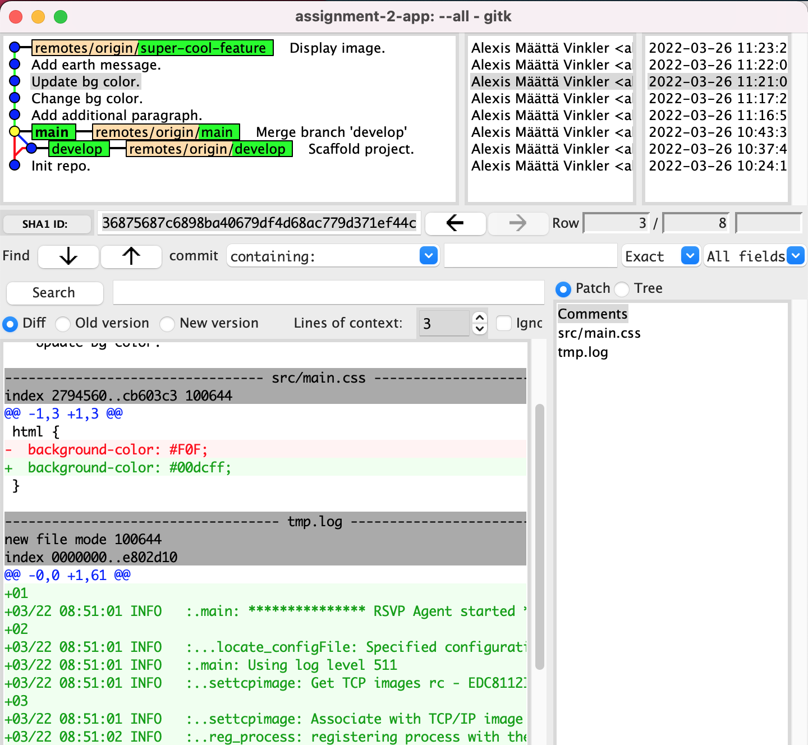

# Assignment 2 - Undoing changes

Photo by <a href="https://unsplash.com/@wilsonjim?utm_source=unsplash&utm_medium=referral&utm_content=creditCopyText">Jim Wilson</a> on <a href="https://unsplash.com/s/photos/revert?utm_source=unsplash&utm_medium=referral&utm_content=creditCopyText">Unsplash</a>

As a developer you're occasionally faced with the need to undo (or rather redo) a series of commits – just like the original poster of [this](https://stackoverflow.com/questions/927358/how-do-i-undo-the-most-recent-local-commits-in-git) Stack Overflow question (with over 10M views).

Common reasons for wanting to undo changes are:
- Embarassing typo in commit message (or forgotten changes/files as part of commit)
- Committing changes on the wrong branch, e.g. straight in `main` instead of in a feature branch.
- Committing unwanted files, such as logs, binaries, or libraries, never intended for source code versioning

In this assignment you'll learn how to rework your history based on these common problems.

## Purpose & Goal
- Get comfortable undoing changes and rework your git history
- Deepen your knowledge about `remote` vs `local` branches, and `remote` vs `local` repositories
- Learn about "do's and dont's" related to rewriting public histories
- Understand the difference between `log` and `reflog`

## Expectations
- Work in pairs and pair program on one computer

## The assignment
This assignment allows you to practice undoing common mistakes.

In short:
- [ ] Amend a previous commit
- [ ] Reset a branch to a previous state
- [ ] Rewrite a public history

### Amend last commit
1. __Fork__ and __clone__ [THIS](https://github.com/Stjaertfena/assignment-2-app) repo, and create a new branch off `develop` (name it whatever you like)
1. Edit the `/src/index.html` file (in the cloned repo) by changing the content of the first paragraph (write whatever you like). Add the change and commmit it, make sure to write a **_bad_** commit message (the idea is to rewrite this later); don't push your change to remote!
1. **Note** the unique commit hash for the just created commit, for example using:
  ```
  $ git show HEAD --no-patch
  ```
  and check the history using `$ gitk --all`, or `$ git log --graph --all --oneline`

1. Now amend the commit (to fix your error) using
  ```
  $ git commit --amend
  ```
  Your default editor (which is most likely going to be [vi](https://en.wikipedia.org/wiki/Vi) or [vim](https://en.wikipedia.org/wiki/Vim_(text_editor))) will open, showing information about the last commit.

1. Edit the commit message (and correct your error), finalize the process by saving and closing the file.
1. View the last commit again using:
  ```
  $ git show HEAD --no-patch
  ```
  and compare the hash with the previous one. You can also refresh/reload `gitk`, pay close attention to your history.

  ❓ **Why do hashes differ? And where did the old misspelled commit go?**

1. Launch `gitk` again and provide the `--reflog` flag, or use the regular `reflog`, see if you can find the now orphaned old commit containing the misspelled message.

  ```
  $ gitk --reflog

  # or
  $ git reflog
  ```

1. With the orphaned commit identified, push the branch to your forked remote repo.

Congratulations, you have now completed the first part of this assignment! Simply amending the last unpublished commit. 🎉

### Move branches/commits (committed in wrong branch) and reset original branch
1. Switch to the `main` branch and verify it's set up to track it's remote counterpart `origin/main`.

1. Open the file `/src/index.html` (again, in your forked repo) and edit the first paragraph (write whatever you like); commit your changes (but don't push it!).

1. Now make two additional changes to the file (for example adding a couple of more paragraphs). Make sure to commit the changes in two separate commits (but don't push the commits!).

You should now have a history where you're three commits ahead of `origin/main`, `git status` should tell you this.

  ```
  $ git status

  On branch main
  Your branch is ahead of 'origin/main' by 3 commits.
    (use "git push" to publish your local commits)

  nothing to commit, working tree clean
  ```

#### Resetting main
Let's say we now realize that our three commits were committed on the wrong branch, i.e. straight onto `main` instead of a feature branch. We now need to "move" the three _unpublished_ commits onto a new branch, and reset our local `main` branch to yet again be in synch with `origin/main`.

1. Create a new feature branch from the tip of `main`, and call it something descriptive, using:
  ```
  E.g.
  $ git branch feature-foo main
  ```
  Above command creates a new branch named `feature-foo` from where `main` is at, but without switching to it.

1.  Verify that the branch got created correctly by viewing your latest commit in the terminal as well as in **gitk**.
  ```
  E.g.
  $ git log --graph --oneline --no-patch

  * 501d07c (HEAD -> main, feature-foo) Baz
  * a9904a1 Bar
  * 3687568 Foo
  * 848020f (origin/main) Init repo
  ```
  
  Above history is just an example, your's will be different but should still be three commits ahead of `origin/main`!

1. Push your **new** branch to your remote fork, so it's safely stored on the server (but don't push **main**!). Pushing a non checked-out branch can be done with: `$ git push origin feature-foo`

1. With the commits stored in your new branch, it's now time to reset `main` so it's in synch with origin. Or in other words, move our local `main` branch back to point to the same commit as `origin/main`.
  ```
  E.g. below command would do the trick if main is currently checked-out
  $ git reset --hard origin/main
  ```

  You are all done when history resembles something like this (_main_ and _origin/main_ should be in sync and your feature branch should be three commits ahead):
  
  _Above picture doesn't contain a remote-tracking branch for feature-foo, but yours should._

  and `git status` tells you:
  ```
  $ git status
  On branch main
  Your branch is up to date with 'origin/main'.

  nothing to commit, working tree clean
  ```

  ❓ **How does the outcome differ if you use `--soft`, `--hard` or `--mixed` when performing the `reset` action?**

  ❓ **Which is the default flag?**

  ❓ **Which flag is potentially destructive?**

Congratulations, you have now completed the second part of this assignment! Resetting a branch to a previous state, and "moving" commits onto a new branch! 🎉

### Rewriting a public history
Now consider the `super-cool-feature` branch (also present in your forked and cloned repo). It has 5 commits and stems of `main`. However, the third commit (`super-cool-feature~2`) counting from the top contains an accidentally committed huge log file. Before this branch can be merged with `main` it needs to have the log file removed completely, to not bloat the repo for all eternity – but without loosing the color change also present in the same commit.

  

What's different this time is that the branch about to be rewritten is already present on remote (i.e. the branch and it's commit has already been publicly available), also it's not the last commit that contains the error but an earlier commit.

Your job is to clear the file from the branch using an _interactive rebase_ and update both the **local** and **remote** repos.

  1. Switch to `super-cool-feature` and verify you can see the _tmp.log_ file in your Working Tree.

  1. Rebase the branch on the same commit it already stems from and make sure to provide the `--interactive` flag, e.g. the `main` branch.
  ```
  $ git rebase main --interactive
  ```
  Below is just an illustration of the interactive rebase "prompt", your's will of course contain the commits you just selected. Do note that the commits here are listed in reversed order, with the most recent commit at the bottom.
  

  In the "prompt" (which is in fact a temporary file), change from `pick` to `edit` infront of the offending commit. Save and close the "prompt".

  If you have not changed your default editor, this is most likely going to be [vi](https://en.wikipedia.org/wiki/Vi) or [vim](https://en.wikipedia.org/wiki/Vim_(text_editor)). Need help with the commands, checkout this [cheat sheet](https://www.thegeekdiary.com/basic-vi-commands-cheat-sheet/).

  1. Git has now dropped you on the offending commit. You can view the state either from `gitk` or using `git status`. Below output and screenshot only serves as an illustration, you'd be seeing something different.
  ```
  $ git rebase main --interactive

  Stopped at bd1ee80...  Bar # empty
  You can amend the commit now, with

      git commit --amend

  Once you are satisfied with your changes, run

      git rebase --continue
  ```
  

  ```
  $ git status
    interactive rebase in progress; onto 04acbc7

    Last commands done (2 commands done):
       pick 4bbc252 Foo # empty
       edit bd1ee80 Bar # empty

    Next command to do (1 remaining command):
       pick 501d07c Baz # empty
      (use "git rebase --edit-todo" to view and edit)

    You are currently editing a commit while rebasing branch 'feature-foo' on '04acbc7'.
      (use "git commit --amend" to amend the current commit)
      (use "git rebase --continue" once you are satisfied with your changes)

    nothing to commit, working tree clean
  ```

  1. You are now able to edit the content of the commit, and remove the log-file. For example using:
  ```
  $ git rm ./tmp.log
  ```

  1. With the removal action completed, continue the rebase process with `git rebase --continue`.

  1. With the rebase completed, view your history again using `gitk`.

  ❓ **Why are only the final three commits diverging, when the rebase was started with main as starting point?**

**Forcefully update remote reference (e.g. rewriting public histories)**

With our local branch cleared from the offending log-file, it's time to persist the change remotely as well. But since the branch and it's commits was already present on remote, we need to forcefully overwrite it (rewriting the public history).
1. Start by identifying your current state using:
  ```
  $ git status

  On branch super-cool-feature
  Your branch and 'origin/super-cool-feature' have diverged,
  and have 4 and 4 different commits each, respectively.
      (use "git pull" to merge the remote branch into yours)

  nothing to commit, working tree clean
  ```
  Notice that you are now 4 commits ahead and 4 behind at the same time.

1. Try publishing your change using a regular `push` and notice the feedback given by the terminal.

1. Since you've rewritten a public history, it now needs to be forcefully overwritten on the remote server. **THIS IS A DESTRUCTIVE OPERATION - only perform this on branches you control!** Use below command to forcefully overwrite the remote branch.
  ```
  $ git push origin super-cool-feature --force
  ```
  If other developers have already based any new changes on this history, they'll be confused by your rewritten history. Communication is everything!

1. Now verify that everything looks as expected by running `git status` and confirm by inspecting the history in `gitk`. `super-cool-feature` and `origin/super-cool-feature` should now be in synch!

Congratulations, you have now completed the final part of this assignment, and learnt how to rewrite a public history! 🎉


